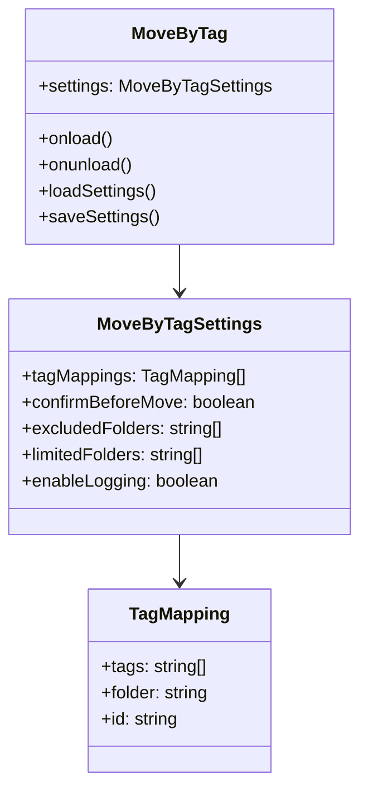
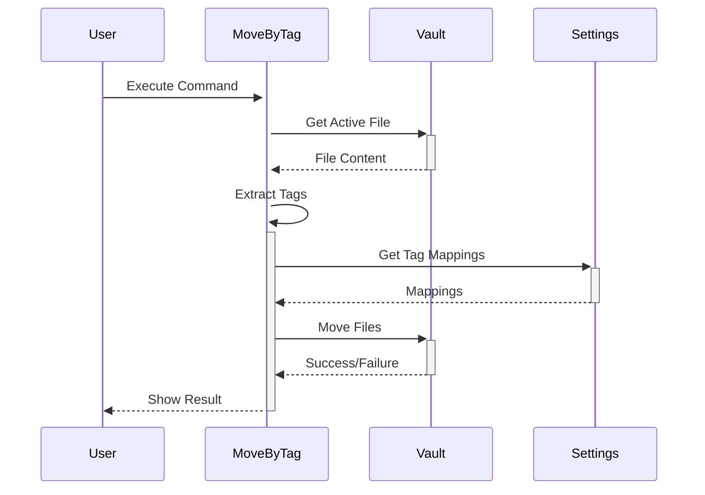
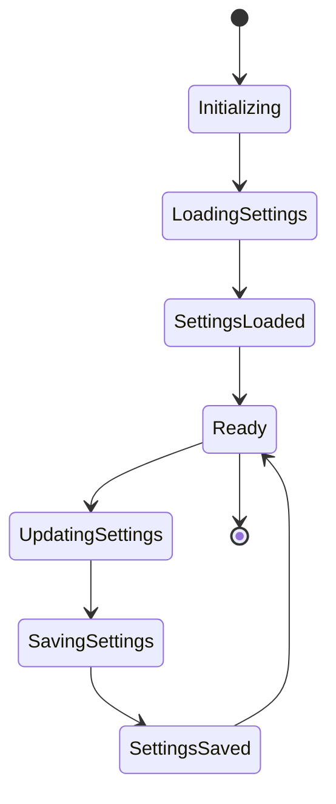

# Move by Tag - Obsidian Plugin

A plugin for [Obsidian](https://obsidian.md) that enables organizing and moving notes based on their tags.

## Features

- Move notes to specific folders based on their tags
- Automated note organization
- Customizable tag-to-folder mapping
- Preserves note content and metadata during moves

## Installation

1. Open Obsidian Settings
2. Navigate to Community Plugins and disable Safe Mode
3. Click Browse and search for "Move by Tag"
4. Install the plugin
5. Enable the plugin in your Obsidian settings

## Usage

1. Add tags to your notes using standard Obsidian tag syntax (#tag)
2. Configure tag-to-folder mappings in the plugin settings
3. Use the command palette to trigger note movements
4. Notes will be automatically moved to their designated folders based on tags

### Development Workflow

1. Make your changes in the TypeScript files
2. Build using `npm run build`
3. Reload Obsidian to see changes

## API Integration

This plugin integrates with:
- Obsidian API (docs.obsidian.md) for plugin functionality

## Contributing

Contributions are welcome! Please feel free to submit a Pull Request.

## License

[MIT License](LICENSE)

## Version History

See [CHANGELOG.md](CHANGELOG.md) for version history.

## Architecture Diagrams

### Plugin Architecture

### Data Flow

### Settings Management

---
Built with:
- Svelte 5
- Tailwind CSS 4
- TypeScript
